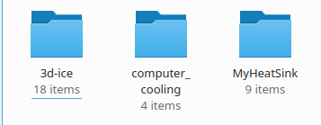

# computer_cooling
This library contains building blocks for modeling cooling systems for integrated circuits and in particularfor CPUs, MPSoCs and the like.

This is a Modelica library, so models can be simlated within a Modelica environment such as [OpenModelica](https://www.openmodelica.org/) for prototyping.

This library is also intnded to create models to be exported as [FMI](https://fmi-standard.org/) (Functional Mockup Interface) for co-simulation with the [3D-ICE MPSoC simulator](https://www.epfl.ch/labs/esl/research/open-source-software-projects/3d-ice/), allowing detailed and accurate simulation of the silicon active layer temperatures when attached with the Modelica-simulatd cooling system.


# HOW TO SIMULATE WITH 3D-ICE

3D-ICE only supports Linux, so Windows users will need to install Linux in a virtual machine. It is suggested to use Ubuntu/Kubuntu or Debian, as OpenModelica is released as .deb packages.
From now on we assume the user has already installed OpenModelica on Linux (the [OpenModelica](https://www.openmodelica.org/) has a guide ofr that), and that the Modelica standard library version 3.2.3 is installed, and we will focus on the 3D-ICE installation part.

## Install dependencies

```
sudo apt install build-essential bison flex libblas-dev csh
sudo apt install libpugixml-dev
sudo apt install python3-dev
sudo apt install pkg-config
```

## Download 3D-ICE
3D-ICE needs to be downloaded in the parent directory of the computer_cooling directory, so that the two directories are side by side.
```
git clone https://github.com/esl-epfl/3d-ice.git
cd 3d-ice
./install-superlu.sh
cd -
```

## Download this library (Computer Cooling)
```
git clone https://github.com/looms-polimi/computer_cooling.git
```

## Copy templates to chosen location
The computer_cooling library comes with a template example showing how to expose a thermal cooling Modelica model for 3D-ICE co-simulation. It can be edited with the OMEdit graphical editor of OpenModelica, but co-simulation has to be done from the command line as 3D-ICE has to load the exported FMI as a plugin.

To use the template, you need to copy it outside of the computer_cooling git repository, at the same directory level of the computer_Cooling and 3D-ICE repositories. This allows, for example, to develop a new heat dissipation model in a git repository having computer_cooling and 3D-ICE as [git submodules](https://git-scm.com/book/en/v2/Git-Tools-Submodules).

```
cp -r computer_cooling/Modelica/Templates/3DICE_Templates MyHeatSink
```
After this command, the 3d-ice, computer_cooling and MyHeatSink directories shall all be side by side



## Start simulation with 3D-ICE
```
cd MyHeatSink
chmod +x simulate.sh
./simulate.sh
```
